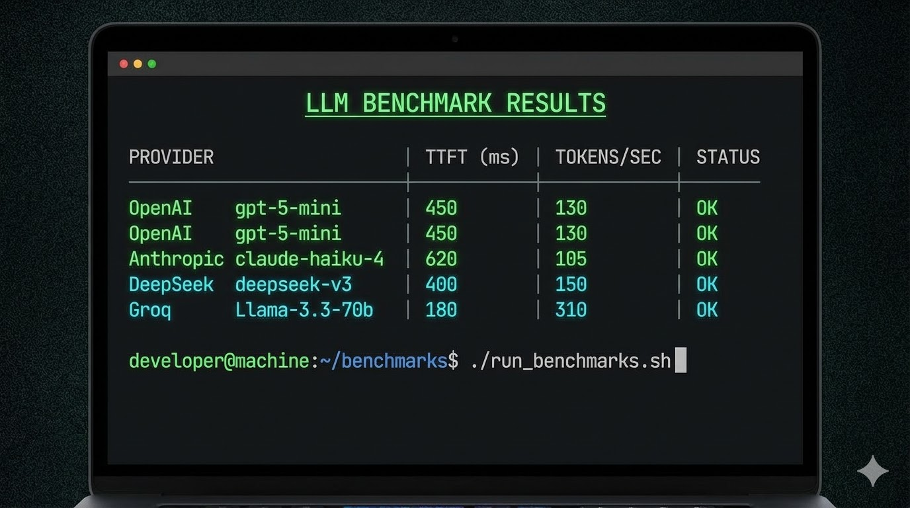
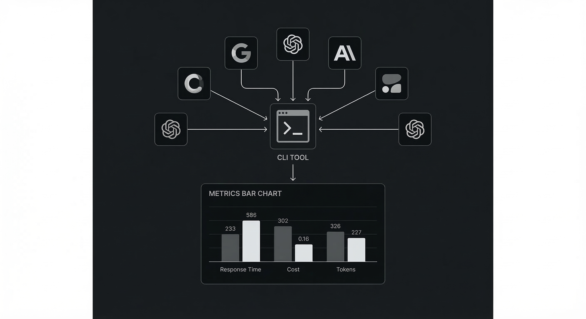

# llm-gateway-bench

> 在决定使用哪个 LLM 提供商、网关或部署方案之前，先用真实流量把性能测清楚。

[English](README.md) | [简体中文](README.zh-CN.md) | [日本語](README.ja.md)

<p align="center">
  <a href="https://github.com/mnbplus/llm-gateway-bench/actions/workflows/ci.yml">
    
  </a>
  <a href="https://github.com/mnbplus/llm-gateway-bench/releases">
    
  </a>
  <a href="https://github.com/mnbplus/llm-gateway-bench/stargazers">
    
  </a>
  <a href="https://pypi.org/project/llm-gateway-bench/">
    
  </a>
  <a href="LICENSE">
    
  </a>
</p>

<p align="center">
  <a href="https://mnbplus.github.io/llm-gateway-bench/">文档</a> ·
  <a href="docs/quickstart.md">快速开始</a> ·
  <a href="docs/providers.md">Provider 列表</a> ·
  <a href="https://pypi.org/project/llm-gateway-bench/">PyPI</a> ·
  <a href="https://github.com/mnbplus/llm-gateway-bench/releases">Releases</a>
</p>

<p align="center">
  
</p>

## 为什么做这个工具

价格页和模型介绍页通常回答不了真正上线前关心的问题：

- 同样的 prompt 形态下，哪个 provider 的 TTFT 最好？
- 并发上去之后，吞吐和尾延迟怎么变？
- 自建网关到底比上游 API 快还是慢？
- 模型切换、区域切换、版本发布后，性能有没有回退？

`llm-gateway-bench` 用一套可重复的 CLI 流程，把这些问题直接测出来。

## 它能做什么

| 测什么 | 比什么 | 导出什么 |
| --- | --- | --- |
| TTFT、总延迟、p50/p95、吞吐、成功率 | Provider、网关、区域、版本、自托管服务 | Markdown、JSON、CSV，以及本地历史记录 |

| 适合场景 | 典型目标 |
| --- | --- |
| Provider 选型 | OpenAI、Anthropic、Gemini、Groq、DeepSeek、OpenRouter |
| 网关验证 | 各类 OpenAI-compatible relay 和 API gateway |
| 基础设施回归检查 | 区域变更、负载均衡、模型上线、自托管推理服务 |

## 最快上手

```bash
pip install llm-gateway-bench

# 查看内置 provider 默认配置
lgb providers

# 快速压一个 provider / model
lgb run --provider openai --model gpt-5-mini --requests 20 --concurrency 3 \
  --prompt "用一句话打个招呼。"

# 用 YAML 比较多个 provider
lgb compare example-bench.yaml --output report.md
```

## 命令结构

| 命令 | 作用 |
| --- | --- |
| `lgb run` | 用命令行参数跑单 provider / model 基准 |
| `lgb compare` | 用 `bench.yaml` 跑多 provider 对比 |
| `lgb warmup` | 在正式压测前先检查连通性 |
| `lgb history` | 查看并比较历史结果 |
| `lgb providers` | 显示内置 provider 默认值和环境变量名 |

## 配置示例

```yaml
prompts:
  - "写一首关于海洋的俳句。"

providers:
  - name: openai
    model: gpt-5-mini
    api_key: ${OPENAI_API_KEY}

  - name: gemini
    model: gemini-2.5-flash
    base_url: https://generativelanguage.googleapis.com/v1beta/openai/
    api_key: ${GEMINI_API_KEY}

  - name: deepseek
    model: deepseek-v3
    base_url: https://api.deepseek.com/v1
    api_key: ${DEEPSEEK_API_KEY}

settings:
  requests: 20
  concurrency: 3
  timeout: 30
```

```bash
lgb compare bench.yaml --output report.md --save
```

## 常见工作流

1. 先用 `lgb providers` 确认默认地址和环境变量名。
2. 如果想先做连通性检查，跑 `lgb warmup bench.yaml`。
3. 调单个目标时，用 `lgb run`。
4. 做正式横向对比时，用 `lgb compare`。
5. 想看回归变化时，用 `lgb history --compare <id1> <id2>`。

## 可以测哪些目标

- 前沿 API：OpenAI、Anthropic、Google Gemini
- 成本/性能型平台：DeepSeek、Groq、Together、Fireworks、OpenRouter、Mistral、Cohere、Perplexity
- 国内与区域化平台：DashScope、SiliconFlow、Zhipu、Moonshot、Baidu、01AI、MiniMax
- 本地和自托管：Ollama、vLLM、LM Studio
- 任意 OpenAI-compatible endpoint：通过 `--base-url` 或 YAML `base_url`

完整矩阵见 [docs/providers.md](docs/providers.md)。

## 输出示例

```text
┌─────────────────┬──────────────────────┬──────────┬────────────┬──────────────┐
│ Provider        │ Model                │ TTFT (ms)│ Total (ms) │ Tokens/sec   │
├─────────────────┼──────────────────────┼──────────┼────────────┼──────────────┤
│ openai          │ gpt-5-mini           │  198     │  1240      │  94.5        │
│ anthropic       │ claude-haiku-4       │  312     │  1680      │  76.2        │
│ gemini          │ gemini-2.5-flash     │  280     │  1520      │  82.1        │
│ deepseek        │ deepseek-v3          │  720     │  2800      │  48.3        │
│ groq            │ llama-3.3-70b        │   95     │   880      │ 210.5        │
└─────────────────┴──────────────────────┴──────────┴────────────┴──────────────┘
```

## 项目边界

- 当前只针对 OpenAI-compatible `chat.completions.create(stream=True)` 接口。
- 不做 provider 原生 API 的专项 benchmark 流程。
- 如果某个服务“宣称兼容”但行为有差异，建议先用 `warmup` 验证。

<p align="center">
  
</p>

## 下一步

- 看 [Quickstart](docs/quickstart.md)
- 用 [Configuration](docs/configuration.md) 组织 YAML 测试集
- 到 [Providers](docs/providers.md) 查 provider 备注
- 在 [Advanced usage](docs/advanced.md) 里看 CI 和批量用法

## 贡献

欢迎 PR。参见 [CONTRIBUTING.md](CONTRIBUTING.md) 和 [docs/contributing.md](docs/contributing.md)。

## 许可证

MIT。详见 [LICENSE](LICENSE)。
