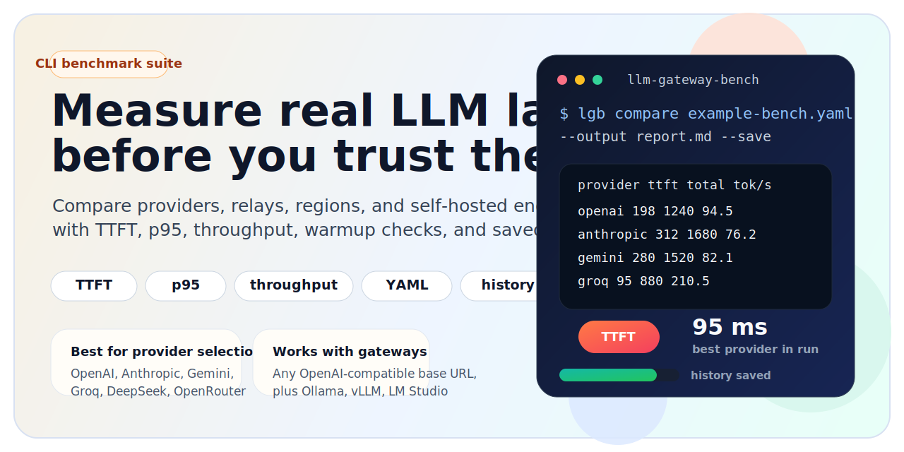

<div class="landing-page" markdown="1">

# llm-gateway-bench

{ .hero-banner }

*Benchmark real-world latency, TTFT, and throughput for LLM providers and OpenAI-compatible gateways.*

`llm-gateway-bench` is built for one job: measuring what pricing pages and model cards cannot tell you.

[Quickstart](quickstart.md){ .md-button .md-button--primary }
[Provider Matrix](providers.md){ .md-button }
[GitHub Repo](https://github.com/mnbplus/llm-gateway-bench){ .md-button }

---

## What it helps you answer

- Which provider has the best TTFT for my prompt shape?
- What happens to latency and throughput when concurrency increases?
- Did a deploy, region change, model switch, or gateway release regress performance?
- Is my OpenAI-compatible relay actually faster than the upstream API?

---

## Designed for real comparison work

| Measure | Compare | Export |
| --- | --- | --- |
| TTFT, total latency, p50, p95, throughput, success rate | Providers, relays, regions, releases, self-hosted endpoints | Markdown, JSON, CSV, plus local run history |

| Best fit | Typical targets |
| --- | --- |
| Provider evaluation | OpenAI, Anthropic, Gemini, Groq, DeepSeek, OpenRouter |
| Gateway validation | OpenAI-compatible relay layers and API gateways |
| Regression tracking | Regional routing changes, load balancers, model rollouts, self-hosted serving |

---

## Core workflow

1. Inspect built-in defaults with `lgb providers`.
2. Validate reachability with `lgb warmup bench.yaml`.
3. Tune one target with `lgb run`.
4. Compare a full suite with `lgb compare`.
5. Save and compare runs later with `lgb history --compare`.

---

## Fast start

```bash
pip install llm-gateway-bench

lgb providers

lgb run --provider openai --model gpt-5-mini --requests 20 --concurrency 3 \
  --prompt "Say hello in one sentence."

lgb compare example-bench.yaml --output report.md --save
```

---

## Example benchmark suite

```yaml
prompts:
  - "Write a haiku about the ocean."

providers:
  - name: openai
    model: gpt-5-mini
    api_key: ${OPENAI_API_KEY}

  - name: gemini
    model: gemini-2.5-flash
    base_url: https://generativelanguage.googleapis.com/v1beta/openai/
    api_key: ${GEMINI_API_KEY}

  - name: deepseek
    model: deepseek-v3
    base_url: https://api.deepseek.com/v1
    api_key: ${DEEPSEEK_API_KEY}

settings:
  requests: 20
  concurrency: 3
  timeout: 30
```

See [Configuration](configuration.md) for the full schema.

---

## Supported targets

Out of the box, `llm-gateway-bench` ships with defaults for:

- OpenAI, Anthropic, Google Gemini
- DeepSeek, Groq, Together, Fireworks, OpenRouter, Mistral, Cohere, Perplexity
- DashScope, SiliconFlow, Zhipu, Moonshot, Baidu, 01AI, MiniMax
- Ollama, vLLM, LM Studio
- Any OpenAI-compatible endpoint via `base_url`

For the full matrix and provider-specific notes, see [Providers](providers.md).

---

## Scope

- Targets OpenAI-compatible streaming chat completion APIs
- Optimized for benchmarking, not API proxying or model routing
- Best fit for provider evaluation, gateway validation, and performance regression tracking

---

## Continue

- Get running in minutes: [Quickstart](quickstart.md)
- Build reproducible suites: [Configuration](configuration.md)
- Check provider gotchas: [Providers](providers.md)
- Wire it into CI: [Advanced usage](advanced.md)

</div>
