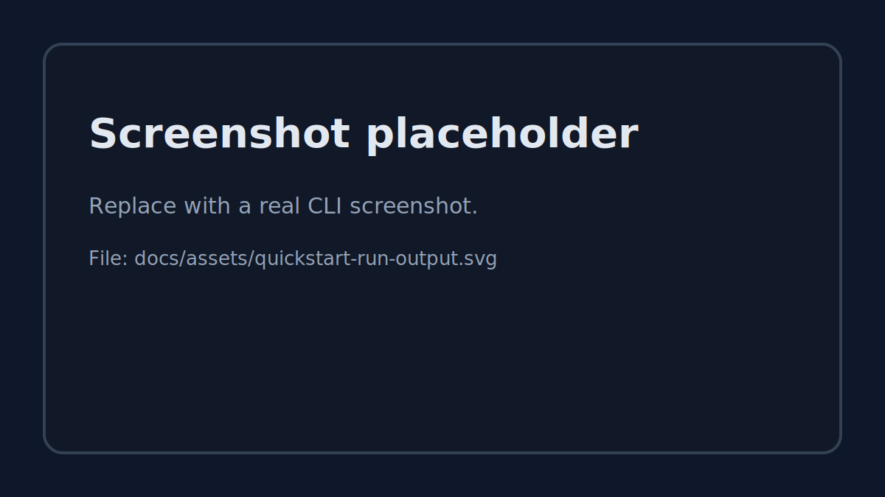
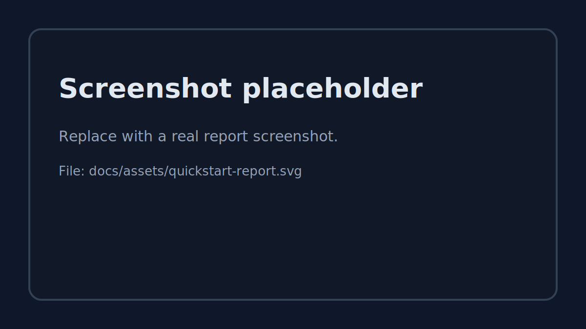

# Quickstart (5 minutes)

This tutorial gets you from **zero → first benchmark** quickly.

> This project benchmarks **OpenAI-compatible streaming** chat completion APIs.

---

## 1) Install

```bash
pip install llm-gateway-bench
```

Confirm:

```bash
lgb --help
lgb providers
```

---

## 2) Set an API key

### OpenAI (example)

macOS/Linux:

```bash
export OPENAI_API_KEY="..."
```

Windows PowerShell:

```powershell
$Env:OPENAI_API_KEY = "..."
```

You can also put keys in a `.env` file (auto-loaded at runtime).

---

## 3) Run a single-provider benchmark

```bash
lgb run \
  --provider openai \
  --model gpt-4.1-mini \
  --requests 20 \
  --concurrency 3 \
  --timeout 30 \
  --prompt "Explain what TTFT means in one sentence."
```

**Screenshot placeholder:**



You will get a table including:

- **TTFT (ms)**: time to first token (lower is better)
- **Total (ms)**: end-to-end latency
- **Tokens/sec**: completion tokens per second (approx.)
- **P95 (ms)**: tail latency

---

## 4) Compare multiple providers with YAML

This repo includes an example config:

```bash
lgb compare example-bench.yaml --output report.md
```

**Screenshot placeholder:**


---

## 5) Open the report

Open `report.md` and paste it into an issue/PR, or commit it to track regressions.

**Screenshot placeholder:**



---

## Next steps

- Learn the full config schema: [Configuration](configuration.md)
- Set up provider-specific base URLs / keys: [Providers](providers.md)
- Try power-user workflows: [Advanced usage](advanced.md)
